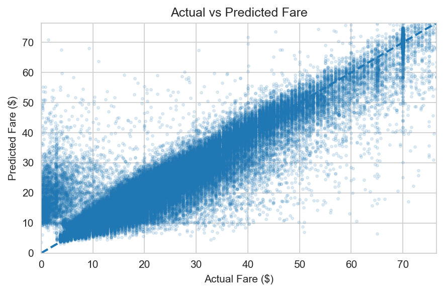
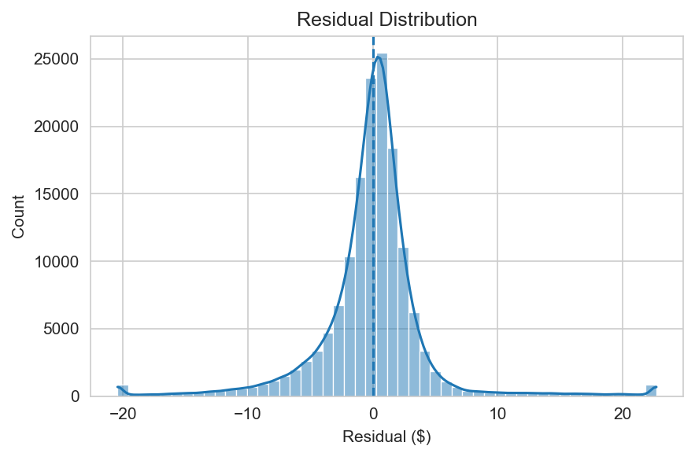
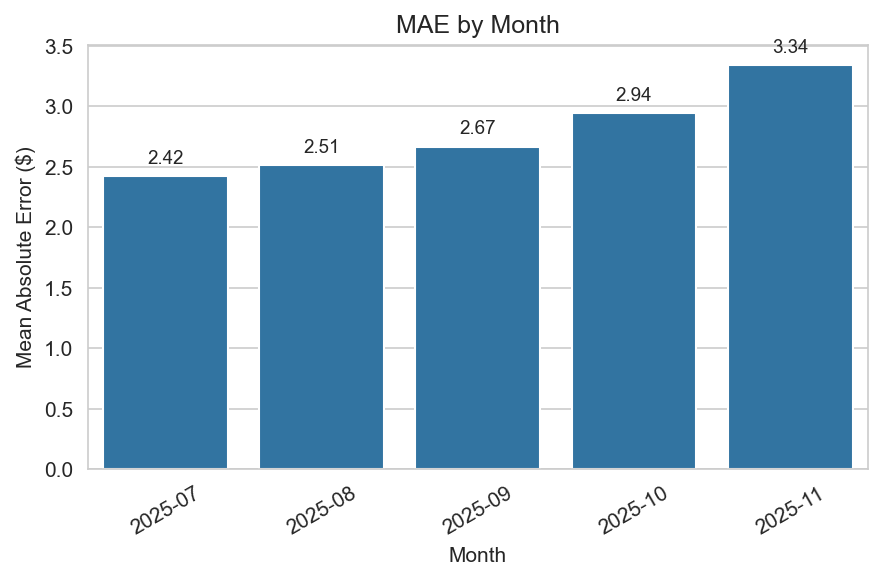
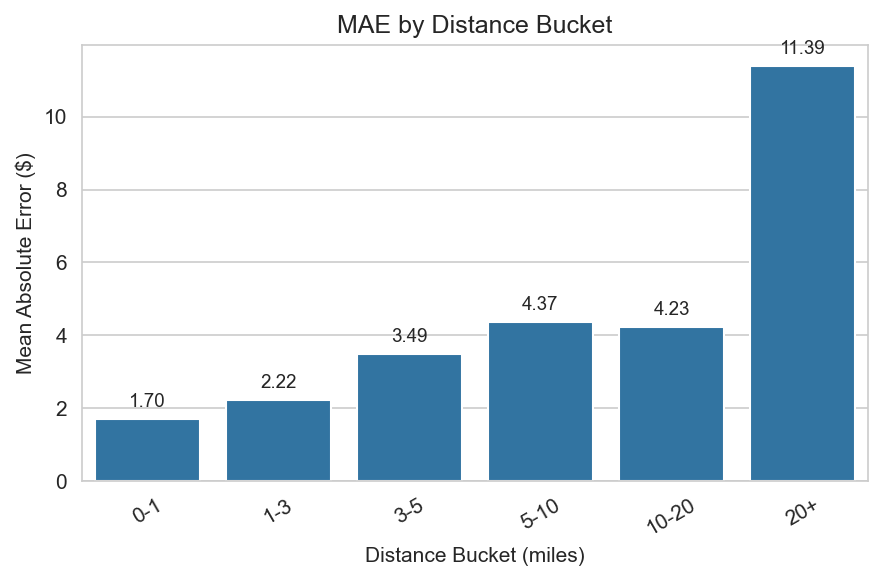
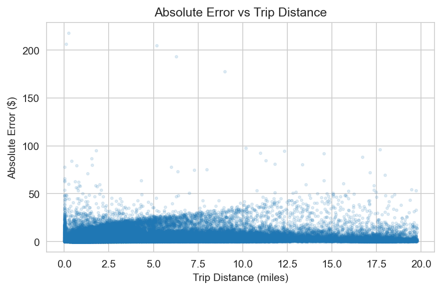
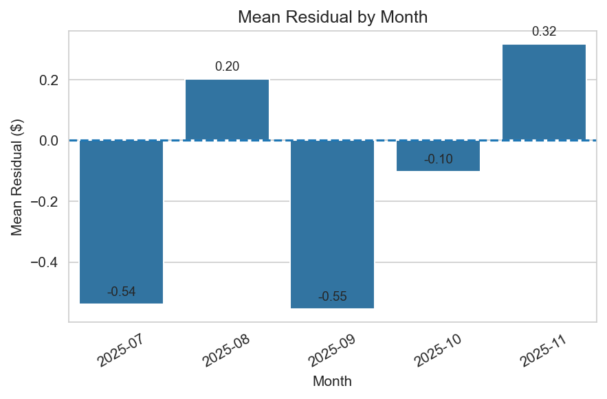

# NYC Taxi Fare Prediction: Temporal XGBoost Pipeline

## Overview

In this project i built a multi year tabular ML pipeline for predicting NYC yellow taxi fare using data from 2023 until 2025.
It is a real world dataset obtained from nyc.gov website. I did not want to just predict a number but also deeply understand how XGBoost works under the hood and also how to effectively model time based data. 
This project served as a playground for mastering temporal feature engineering and building a robust ML pipeline that respects the chronological nature of real-world data.
---

## Problem Statement
Given trip-level taxi metadata, can we predict `fare_amount` using only features that are valid at prediction time?

The goal was not just to train an XGBoost model, but to build a workflow that answers questions like:

- How clean and consistent is the raw data across years?
- What data quality issues must be handled before modeling?
- How should a fare model be evaluated in a **temporally realistic** way?
- Which spatial features actually help?
- Where does the model fail?

---

## Why I built this

I built this project to go beyond a typical “train XGBoost on a dataset” exercise and instead demonstrate a more realistic machine learning workflow on large-scale tabular data.

The goal was to show that I can:
- work with messy multi year parquet data
- audit and normalize inconsistent schemas
- build a leakage safe temporal modeling setup
- run controlled feature and hyperparameter experiments
- diagnose model behavior instead of relying only on a single metric

I intentionally treated this as a **real world tabular ML problem**, where data quality, validation design, and error analysis matter as much as the model itself.

## Repository Structure

```text
nyc_taxi/
├── reports/
│   └── data_quality/             # generated audits / summaries
├── notebooks/
│   ├── 03_baseline_split_and_sanity_checks.ipynb
│   ├── 04_xgboost_baseline.ipynb
│   └── 05_xgboost_hyperparameter_study.ipynb
├── src/
│   └── data/
│       ├── schema_audit.py
│       ├── make_dataset_multi_year.py
│       ├── data_quality_audit.py
│       └── build_model_df_multi_year.py
├── .gitignore
└── README.md
```

## What I built


## 1. Dataset 

This project uses **NYC Yellow Taxi trip data** from:

- **2023**: 12 monthly parquet files  
- **2024**: 12 monthly parquet files  
- **2025**: 11 monthly parquet files (Jan–Nov)

In total, the project worked with:
- **35 parquet files**
- **123M+ normalized rows** across all years

The target variable for modeling was:

- `fare_amount`

The main modeling features were built from:
- trip distance
- passenger count
- pickup timestamp
- vendor / ratecode metadata
- pickup and dropoff location IDs

The project used only features that were valid for the chosen prediction framing and intentionally excluded post-trip variables that would leak future information.

Before modeling, I first audited the raw parquet files across years to understand whether the data could even be combined safely.

## 2. Dataset Cleaning

Before modeling, I first audited the raw parquet files across years to understand whether the data could even be combined safely
### Main data engineering and cleaning steps

#### Schema audit and Normalization
I inspected all raw monthly parquet files to detect:
- column-name inconsistencies across years
- dtype mismatches
- schema evolution over time
- missing and extra columns
I then normalized all the irregularities from the Schema audit report so that all the files had the same schema.

#### Data quality audit
After normalization, I audited:
- invalid or out-of-window timestamps
- non-positive fares
- non-positive trip distances
- zero / negative trip durations
- missingness in modeling features

**Structural validity rules**
- non-null pickup/dropoff timestamps
- valid time window for each source year
- positive trip duration

**First-pass clean modeling rules**
- `fare_amount > 0`
- `trip_distance > 0`

I then created model ready dataset wtih temporal validity and first pass cleaning rules

## 3. Baseline Model

I built a baseline **XGBoost regressor** using a proper preprocessing pipeline.

### Validation design
Instead of a random split, I used a **temporal split**:

- **Train**: 2023–2024
- **Validation**: Jan–Jun 2025
- **Test**: Jul–Nov 2025

This was important because random splits would hide temporal leakage and overstate performance.

### Baseline feature set

- numeric: `trip_distance`, `passenger_count`, `pickup_hour`, `pickup_weekday`, `pickup_month`
- categorical: `VendorID`, `RatecodeID`, `store_and_fwd_flag`, `PULocationID`, `DOLocationID`

### Preprocessing
The baseline used:
- median imputation for numeric features
- constant `"MISSING"` imputation for categorical features
- one-hot encoding for categorical variables

The preprocessing was fit on training data only and reused unchanged on validation and test, making the pipeline leakage-safe.

### Stable baseline result
The stable baseline gave a solid starting point on future holdout data and served as the reference point for all later experiments.

## 4. Baseline Model Predictions Analysis

After fitting the baseline, I did not stop at MAE / RMSE. I analyzed how the model behaved and where it failed.

### Diagnostic plots used
I generated and inspected:

- **Actual vs Predicted scatter plot**
- **Residual distribution**
- **Absolute error vs trip distance**
- **MAE by month**
- **Mean residual by month**
- **MAE by distance bucket**

### What the plots showed

#### Actual vs Predicted
The model tracked the common fare range reasonably well, but predictions were more compressed in the higher-fare region, suggesting weaker performance in the upper tail.

#### Residual distribution
Residuals were mostly centered near zero, which suggested the model was not globally biased, but the tails showed that some trip types were still much harder than others.

#### Error vs distance
Absolute error generally increased with trip distance, especially for longer trips.

#### Temporal drift
Monthly MAE increased from July to November 2025, suggesting that performance degraded over time in the future holdout period.

#### Distance bucket analysis
Short trips were much easier, while long-distance trips had significantly higher error.

### Plots

<!-- 


 -->
<p align="center">
  
  
</p>

<p align="center">
  
  
</p>

<p align="center">
  
  
</p>

## 5. Experiments on Different Features

I ran controlled experiments to understand which features actually improved future generalization. 

### Final Feature Experiment Summary

| Experiment | Valid MAE | Valid RMSE | Test MAE | Test RMSE |
| :--- | :---: | :---: | :---: | :---: |
| **baseline_log_target** | 2.2423 | 4.9067 | 2.7771 | 5.6806 |
| **airport_flags_plus_log_target** | 2.2467 | 4.9316 | 2.7816 | 5.6878 |
| **airport_flags_only_no_log** | 2.2199 | 4.7503 | 2.8352 | 5.7424 |
| **baseline_plus_cyclical** | 2.2250 | 4.7717 | 2.8361 | 5.7622 |
| **baseline_pu_do** | 2.2209 | 4.7544 | 2.8398 | 5.7670 |
| **airport_flags_plus_pu_do_pair_plus_log_target** | 2.2735 | 4.9646 | 2.8417 | 5.8126 |
| **with_pu_do_pair** | 2.2448 | 4.7909 | 2.8759 | 5.7854 |
| **airport_flags_plus_pu_do_pair_no_log** | 2.2420 | 4.8112 | 2.8768 | 5.8087 |
| **with_route_frequency** | 2.2722 | 4.9042 | 2.9983 | 6.1952 |
| **without_pu_do** | 2.4095 | 5.2251 | 3.0685 | 6.2832 |

### Feature Ideas Tested

- [x] Baseline pickup/dropoff zone features
- [x] `PU_DO_pair` route interaction feature
- [x] Route-frequency feature
- [x] Cyclical encoding of hour and month
- [x] Airport-specific flags
- [x] Log-target transformation
- [x] Combinations of airport flags, route features, and log target

## 6. Lessons Learnt from Experiments on Different Features

The feature experiments taught me several useful things:

### $\color{red}{\text{1. Pickup and dropoff zones matter}}$
* **Removing `PULocationID` and `DOLocationID` hurt performance materially.**
* This confirmed that spatial location information is one of the most important signals in the problem.

### $\color{red}{\text{2. Naive route interaction features did not help}}$
* I expected `PU_DO_pair` to help because fare depends strongly on origin–destination patterns.
* However, naive one-hot expansion of the full OD pair actually hurt future holdout performance.
* **Key takeaway:** Route information matters, but it needs more careful encoding than a sparse raw interaction feature.

### $\color{red}{\text{3. Route-frequency feature also hurt}}$
* A train-derived route frequency feature also failed to improve performance.
* This was useful because it showed that not every intuitive route proxy translates into better generalization.

### $\color{red}{\text{4. Cyclical encoding added little}}$
* Cyclical encoding of hour and month did not materially improve test performance.
* In this setup, **XGBoost** was already handling those temporal patterns reasonably well.

### $\color{red}{\text{5. Airport flags were directionally useful}}$
* Airport-specific domain flags were sensible and gave slight gains in some settings.
* Their impact was modest relative to the baseline.

### $\color{red}{\text{6. Log-target transformation helped the most}}$
* The best overall future holdout performance came from applying a `log1p` transformation to the target.
* This makes sense because fare is right-skewed and the log transform stabilizes the tail.


## 7. Experiments on Different Hyperparameters

After the feature experiments, I ran a focused XGBoost hyperparameter study instead of treating the model as a black box.

### Hyperparameters Explored

- `max_depth`: Complexity of individual trees.
- `learning_rate`: Step size shrinkage used in update to prevents overfitting.
- `n_estimators`: Number of boosting rounds.
- `subsample`: Fraction of training data sampled per tree.
- `colsample_bytree`: Fraction of features sampled per tree.
- `min_child_weight`: Minimum sum of instance weight needed in a child.

### Hyperparameter Study Results

| Experiment | n_estimators | max_depth | learning_rate | subsample | colsample_bytree | min_child_weight | Valid MAE | Valid RMSE | Test MAE | Test RMSE |
| :--- | :---: | :---: | :---: | :---: | :---: | :---: | :---: | :---: | :---: | :---: |
| **deeper_trees** | 300 | 10 | 0.08 | 0.8 | 0.8 | 1 | 2.1942 | 4.7571 | 2.7928 | 5.7501 |
| **lower_lr_more_trees** | 500 | 8 | 0.05 | 0.8 | 0.8 | 1 | 2.2162 | 4.7402 | 2.8294 | 5.7482 |
| **baseline** | 300 | 8 | 0.08 | 0.8 | 0.8 | 1 | 2.2227 | 4.7689 | 2.8350 | 5.7415 |
| **stronger_col_sampling** | 300 | 8 | 0.08 | 0.8 | 0.6 | 1 | 2.2216 | 4.7257 | 2.8365 | 5.7057 |
| **more_conservative** | 300 | 8 | 0.08 | 0.8 | 0.8 | 5 | 2.2287 | 4.7628 | 2.8456 | 5.7640 |
| **stronger_row_sampling** | 300 | 8 | 0.08 | 0.6 | 0.8 | 1 | 2.2335 | 4.7743 | 2.8550 | 5.7615 |
| **shallower_trees** | 300 | 6 | 0.08 | 0.8 | 0.8 | 1 | 2.2671 | 4.7827 | 2.9020 | 5.7814 |

## 8. Lessons Learnt from Experiments on Different Hyperparameters

The hyperparameter study helped me understand how XGBoost behaves on this specific problem.

### 1. Shallower trees underfit
* Reducing `max_depth` to 6 clearly worsened performance.
* **Insight:** The fare problem requires capturing meaningful non-linear interactions that shallow trees simply cannot represent.

### 2. Deeper trees improved fit
* Increasing `max_depth` to 10 slightly improved Test MAE in the smaller study.
* **Insight:** There is some benefit from richer interaction modeling, though it must be monitored to ensure it doesn't lead to overfitting on larger datasets.

### 3. Lower learning rate + more trees was competitive
* Using a smaller `learning_rate` with more boosting rounds was competitive, but it did not clearly beat the baseline setup on MAE metrics.

### 4. Regularization and Sampling
* **Stronger row sampling:** Reducing `subsample` hurt performance slightly. The model benefited more from seeing more rows per tree than from stronger row-level regularization.
* **Stronger column sampling:** Reducing `colsample_bytree` was largely neutral, showing only minor metric differences.
* **Conservative `min_child_weight`:** Increasing this value did not produce better future generalization.

> **Main Takeaway:** The biggest gains in this project came more from problem framing, feature decisions, and validation design than from aggressive hyperparameter tuning.

---

## 9. Next Steps

There are several natural next steps that would further strengthen the model's performance and reliability:

### Better Route Encoding
The experiments showed that route information matters, but naive OD-pair features do not generalize well. Future iterations should explore:
* **Target Encoding:** To handle high-cardinality location IDs more effectively.
* **CatBoost:** To utilize its native categorical handling.
* **Frequency-thresholded route interactions:** Filtering for only high-volume routes.

### Residual Analysis over Time
Since I observed temporal degradation in monthly MAE, a deeper month-by-month residual analysis could help separate:
* **Drift:** Actual changes in the market or pricing.
* **Seasonality:** Recurring monthly patterns.
* **Systematic Bias:** Specific zones where the model consistently fails.

### Bounded-Domain Model
Developing a dedicated “standard-trip” model with explicit domain caps could help stabilize the fare-tail behavior and improve predictions for common trips.

### Drift Monitoring
Adding explicit monthly drift analysis would be a useful extension to monitor why later months were harder to predict than earlier months.

### Model Comparison
Benchmarking against **CatBoost** or **LightGBM** would help determine if different tabular models handle high-cardinality spatial features more naturally than the current one-hot + XGBoost approach.